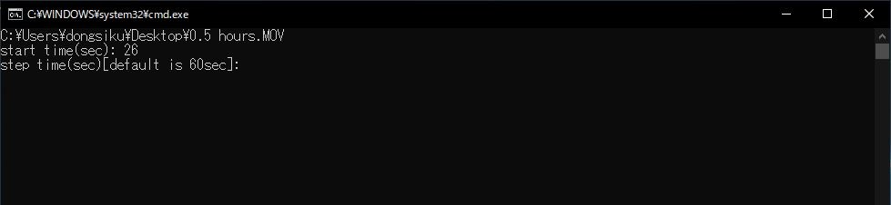

# video_to_picture_everyseconds
This application convert a video file to image files every times that you want. You can specify the start time and step time of the conversion. 
## Environment
This application can be used on `Windows OS 64-bit version`. To run this application on the 32-bit version, these scripts must be modify: `powershell/install.ps1` and `powershell/video_to_picture_everyseconds.ps1`. Note that this application *cannot* be used on **Windows XP or earlier**. 
## Installation
1. Download zipped source code on [GitHub](https://github.com/dongsiku/video_to_picture_everyseconds/releases/latest). It can be downloaded with `Source code (zip)`. 
1. Extract the downloaded zip file. 
1. Click `install.bat` in the extracted folder to download python embeddable file and install packages required for this application. Make sure **the Internet connection is established**. 
1.  When `Completed` appeared, the installation was done. 
## Usage
1. Click `video_to_picture_everyseconds.bat`. 
1. When open-file dialog appeared, choose the video file to convert it to image files. 
1. Input the start time (sec) and press ENTER key. 
1. Input the step time (sec) and press ENTER key. 

    - You can input float for the start and step time. 
    - When you want to convert the video to the picture file every 60sec, you do not have to input time. Press only ENTER key. 
1. When `Successfully completed` appeared, the conversion was done. The folder where the image files were saved also appears. 
## Uninstallation
All you have to do is remove the `video_to_picture_everyseconds` folder. 